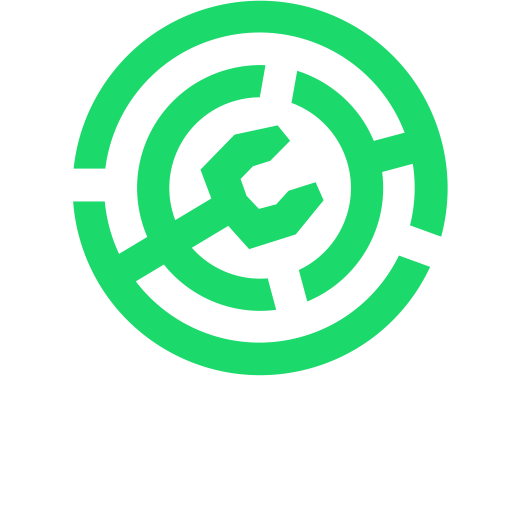

# 👋 欢迎使用RustyConnector

RustyConnector是一款可运行于Velocity/Paper群组网络的负载均衡插件，它可以让你的服务器在运行状态下自动向代理端注册或注销子服务器，并实现玩家之间的负载均衡

 

<table>
<thead>
<tr>
<th width="2000" colspan="2">
</th>
</tr>
<h2>🧭 快速链接</h2>
</thead>
<tbody>
<tr>
  <td width="80" align="center" valign="top">
     
    
  </td>
  <td valign="top">
    <h3>Wiki</h3>
    

      不知道如何使用本插件？<a href="https://github.com/Aelysium-Group/rusty-connector/wiki">点击此链接</a>教你快速入门。
    

  </td>
</tr>
<tr>
  <td width="80" align="center" valign="top">
     
    
  </td>
  <td valign="top">
    <h3>下载插件</h3>
    

      <a href="https://github.com/Aelysium-Group/rusty-connector/releases">点击前往Github Releases下载</a>，或前往插件发布页。
    

  </td>
</tr>
<tr>
  <td width="80" align="center" valign="top">
     
    
  </td>
  <td>
    <h3>帮助支持</h3>
    

      您可<a href="https://join.aelysium.group">点击此链接</a>加入我们的Discord社区获得更多帮助。
    

  </td>
</tr>
<tr>
  <td width="80" align="center" valign="top">
     
    
  </td>
  <td>
    <h3>BUG反馈</h3>
    

      在使用插件的时候遇到了烦人的BUG？ 请<a href="https://github.com/Aelysium-Group/rusty-connector/issues">点击此链接</a>与我们反馈。
    

  </td>
</tr>
</tbody>
</table>

<table>
<thead>
<tr>
<th width="2000" colspan="2">
</th>
</tr>
<h2>🚀 插件发布页</h2>
</thead>
<tbody>
<tr>
  <td width="80" align="center" valign="top">
     
    
  </td>
  <td valign="top">
    <h3>Modrinth</h3>
    

      <a href="https://modrinth.com/plugin/rustyconnector">点击前往Modrinth插件发布页面。</a>
    

  </td>
</tr>
<tr>
  <td width="80" align="center" valign="top">
     
    
  </td>
  <td valign="top">
    <h3>Hanger</h3>
    

      <a href="https://hangar.papermc.io/nathan-i-martin/RustyConnector">点击前往Hanger插件发布页。</a>
    

  </td>
</tr>
</tbody>
</table>

 

---
# ✨ 特色功能
- ### ✅ 为构建大型群组服而生
- ### ✅ 可在运行期间自动向代理端注册全新的子服务器
- ### ✅ 与Redis集成实现超快速度传输
- ### ✅ 可创建预定义的白名单配置并动态开启或关闭它们
- ### ✅ 可通过家族级白名单和负载平衡将类似的服务器注册成家族
- ### ✅ 可自动从代理端中取消注册被冻结的服务器
- ### ✅ 可为你的服务器添加软/硬人数限制
- ### ✅ 专为有状态的Minecraft服务器所打造!
- ### ✅ 支持基于用户名，权限组，UUID和IP地址等形式的白名单功能
- ### ✅ 允许玩家跨服/tpa传送
- ### ✅ 可与LuckPerms-Velocity一起使用
- ### ✅ 支持Kubernetes容器化部署
- ### ✅ 支持Folia服务端
- ### ❌ 它不能做到给你个拥抱或Rickroll了你

---
# 🎨 数据统计

## 🌌 代理端数据统计:

## 🌌 子服务器数据统计:

---
## 🛠 开发中的功能
- [ ] Rounded families (families built for round based gamemodes!) [__Under Development__]
- [ ] Player parties (join your friend's party and follow them around the network as they connect to different families!) [__Under Development__]
- [ ] Websocket as a backup for if Redis fails [__研究中__]
- [ ] Example RustyConnector Networks for Documentation Purposes [__Under Development__]
- [ ] Kubernetes自动伸缩 [__研究中__]
- [ ] RustyConnector API (可能暂时需要咕咕咕了!)
- [ ] Player routing based on client version (低优先级)
- [ ] Teleport players to specific coordinates on other servers (低优先级)

\*Checked boxes indicate that the feature has been added and is awaiting release in an official version. There is no promise on when these features may be added.
\*

---

# 📖 Wiki
### [Home](https://github.com/Aelysium-Group/rusty-connector/wiki)
### [FAQ](https://github.com/Aelysium-Group/rusty-connector/wiki#faq)
### [Getting Started | 快速入门](https://github.com/Aelysium-Group/rusty-connector/wiki/Getting-Started-(First-Time))
  - [Installation | 安装教程](https://github.com/Aelysium-Group/rusty-connector/wiki/Getting-Started-(First-Time))
  - [How it works | 插件是如何工作的?](https://github.com/Aelysium-Group/rusty-connector/wiki/Getting-Started-(First-Time)#how-it-works)
  - [Families | 家族配置](https://github.com/Aelysium-Group/rusty-connector/wiki/Family)
  - [Whitelists | 白名单](https://github.com/Aelysium-Group/rusty-connector/wiki/Whitelist)
  - [Load Balancing | 负载均衡](https://github.com/Aelysium-Group/rusty-connector/wiki/Family#load-balancing)
### [Commands | 插件指令](https://github.com/Aelysium-Group/rusty-connector/wiki/Commands)
### [Permissions | 插件权限](https://github.com/Aelysium-Group/rusty-connector/wiki/Permissions)
### [Configs | 插件配置](https://github.com/Aelysium-Group/rusty-connector/wiki/Config-Migration)
  - [RC-Velocity](https://github.com/Aelysium-Group/rusty-connector/wiki/Config-v2#rc-velocity)
  - [RC-Paper](https://github.com/Aelysium-Group/rusty-connector/wiki/Config-v2#rc-paper)
### [Config Migration | 配置迁移](https://github.com/Aelysium-Group/rusty-connector/wiki/Config-Migration)

---
# 🌠语言切æ¢

Need to switch lang?

2023 © [Aelysium](https://www.aelysium.group)