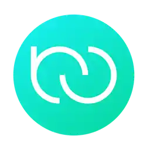

# 👋 歡迎使用RustyConnector

[RustyConnector]是一款可運行於[Velocity]/[Paper]/[Folia]群組網絡的負載均衡插件，它可以讓你的服務器在運行狀態下自動向代理端註冊或取消註冊子服務器，並實現玩家間的負載均衡。

<!-- Table-1 -->
<table>
<thead>
<tr>
<th width="2000" colspan="2">
</th>
</tr>
<h2>🧭 快捷鏈接</h2>
</thead>
<tbody>
<tr>
  <td width="80" align="center" valign="top">
     
    
  </td>
  <td valign="top">
    <h3>Wiki</h3>
   

      不知道如何使用本插件？ <a href="https://github.com/Aelysium-Group/rusty-connector/wiki">點擊此鏈接</a>教你快速入門。
    

  </td>
</tr>
<tr>
  <td width="80" align="center" valign="top">
     
    
  </td>
  <td valign="top">
  <h3>下載插件</h3>
    

      <a href="https://github.com/Aelysium-Group/rusty-connector/releases">點擊前往Github Releases下載</a>，或前往插件發布頁。
    

  </td>
</tr>
<tr>
  <td width="80" align="center" valign="top">
     
    
  </td>
  <td>
  <h3>幫助支持</h3>
    

      您可<a href="https://join.aelysium.group">點擊此鏈接</a>加入我們的Discord社區獲得更多幫助。
    

  </td>
</tr>
<tr>
  <td width="80" align="center" valign="top">
     
    
  </td>
  <td>
  <h3>BUG反饋</h3>
    

      在使用插件的時候遇到了煩人的BUG？請<a href="https://github.com/Aelysium-Group/rusty-connector/issues">點擊此鏈接</a>與我們反饋。
    

  </td>
</tr>
</tbody>
</table>

<!-- Table-2 -->
<table>
<thead>
<tr>
<th width="2000" colspan="2">
</th>
</tr>
<h2>🚀 插件發布頁</h2>
</thead>
<tbody>
<tr>
  <td width="80" align="center" valign="top">
     
    
  </td>
  <td valign="top">
    <h3>Modrinth</h3>
    

      <a href="https://modrinth.com/plugin/rustyconnector">點擊前往Modrinth插件發布頁。</a>
    

  </td>
</tr>
<tr>
  <td width="80" align="center" valign="top">
     
    
  </td>
  <td valign="top">
    <h3>Hanger</h3>
    

      <a href="https://hangar.papermc.io/nathan-i-martin/RustyConnector">點擊前往Hanger插件發布頁。</a>
    

  </td>
</tr>
</tbody>
</table>

---
# ✨ 特色功能
- ### ✅ 為構建大型群組服而生
- ### ✅ 可在運行期間自動向代理端註冊全新的子服務器
- ### ✅ 與Redis集成實現超快速度傳輸
- ### ✅ 可創建預定義的白名單配置並動態開啟或關閉它們
- ### ✅ 可通過家族級白名單和負載平衡將類似的服務器註冊成家族
- ### ✅ 可自動從代理端中取消註冊被凍結的服務器
- ### ✅ 可為你的服務器添加軟/硬人數限制
- ### ✅ 專為有狀態的Minecraft服務器所打造!
- ### ✅ 支持基於用戶名，權限組，UUID和IP地址等形式的白名單功能
- ### ✅ 允許玩家跨服/tpa傳送
- ### ✅ 可與LuckPerms-Velocity一起使用
- ### ✅ 支持Kubernetes容器化部署
- ### ✅ 支持Folia服務端
- ### ❌ 它不能做到給你個擁抱或Rickroll了你

---
# 🎨 數據統計

## 🌌 代理端數據統計 ([點擊查看](https://bstats.org/plugin/velocity/RustyConnector/17972)):

## 🌌 子服務器數據統計 ([點擊查看](https://bstats.org/plugin/bukkit/RustyConnector/17973)):

---
## 🛠 開發中的功能
- [ ] Rounded families (families built for round based gamemodes!) [__開發中__]
- [ ] 玩家派對 (可用於加入好友的派對，並跟隨TA們在群組服上連接到不同的家族!) [__開發中__]
- [ ] Websocket作為Redis故障時的備份 [__研究中__]
- [ ] 用於文檔示例的RustyConnector網絡示例 [__開發中__]
- [ ] Kubernetes自動伸縮 [__研究中__]
- [ ] RustyConnector API (可能暫時需要咕咕咕了!)
- [ ] 基於客戶端版本的玩家路由 (低優先級)
- [ ] 可將玩家傳送至其它服務器的特定坐標上 (低優先級)

\*勾選的方框表示該功能已經被添加，正在等待正式版的發布。 （注: 目前還沒有關於這些功能何時會被添加的承諾）

---
# 📖 Wiki
### [Home](https://github.com/Aelysium-Group/rusty-connector/wiki)
### [FAQ](https://github.com/Aelysium-Group/rusty-connector/wiki#faq)
### [Getting Started | 快速入門](https://github.com/Aelysium-Group/rusty-connector/wiki/Getting-Started-(First-Time))
  - [Installation | 安裝教程](https://github.com/Aelysium-Group/rusty-connector/wiki/Getting-Started-(First-Time))
  - [How it works | 插件是如何工作的?](https://github.com/Aelysium-Group/rusty-connector/wiki/Getting-Started-(First-Time)#how-it-works)
  - [Families | 家族配置](https://github.com/Aelysium-Group/rusty-connector/wiki/Family)
  - [Whitelists | 白名單](https://github.com/Aelysium-Group/rusty-connector/wiki/Whitelist)
  - [Load Balancing | 負載均衡](https://github.com/Aelysium-Group/rusty-connector/wiki/Family#load-balancing)
### [Commands | 插件指令](https://github.com/Aelysium-Group/rusty-connector/wiki/Commands)
### [Permissions | 插件權限](https://github.com/Aelysium-Group/rusty-connector/wiki/Permissions)
### [Configs | 插件配置](https://github.com/Aelysium-Group/rusty-connector/wiki/Config-Migration)
  - [RC-Velocity](https://github.com/Aelysium-Group/rusty-connector/wiki/Config-v2#rc-velocity)
  - [RC-Paper](https://github.com/Aelysium-Group/rusty-connector/wiki/Config-v2#rc-paper)
### [Config Migration | 配置遷移](https://github.com/Aelysium-Group/rusty-connector/wiki/Config-Migration)

---
## 🌐 語言切換

语言切换 / Need to switch languages?

2023 © [Aelysium](https://www.aelysium.group)

<!-- URL LIST -->
[Folia]:https://github.com/PaperMC/Folia
[Paper]: https://papermc.io
[Velocity]: https://velocitypowered.com
[RustyConnector]: https://github.com/Aelysium-Group/rusty-connector